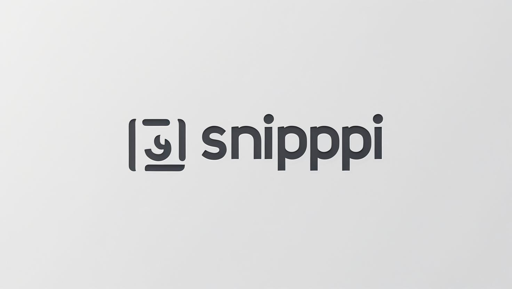

# Snippi - Code Snippet Manager



## 📋 Descrizione

Snippi è un'applicazione web moderna e intuitiva per la gestione dei tuoi snippet di codice. Organizza, cerca e riutilizza facilmente i tuoi frammenti di codice preferiti con un'interfaccia elegante e funzionale.

## ✨ Caratteristiche Principali

### 🎨 Design Moderno
- **Interfaccia Dark Mode**: Design elegante con tema scuro per ridurre l'affaticamento degli occhi
- **Glassmorphism Effects**: Effetti di vetro smerigliato per un look moderno e professionale
- **Animazioni Fluide**: Transizioni e animazioni smooth per un'esperienza utente coinvolgente
- **Responsive Design**: Perfettamente ottimizzato per desktop, tablet e mobile

### 🔍 Ricerca e Filtri Avanzati
- **Ricerca Intelligente**: Cerca per nome, contenuto del codice o tag
- **Filtri per Linguaggio**: Filtra gli snippet per linguaggio di programmazione
- **Filtri per Tag**: Organizza e trova snippet tramite tag personalizzati
- **Filtri Attivi Visibili**: Visualizzazione chiara dei filtri applicati con possibilità di rimozione rapida

### 📝 Gestione Snippet
- **Creazione Facile**: Modal intuitivo per aggiungere nuovi snippet
- **Modifica Rapida**: Modifica gli snippet esistenti con un click
- **Eliminazione Sicura**: Conferma prima dell'eliminazione per evitare perdite accidentali
- **Copia Istantanea**: Copia il codice negli appunti con feedback visivo

### 🏷️ Organizzazione
- **Tag Multipli**: Aggiungi più tag per categorizzare i tuoi snippet
- **Linguaggi Supportati**: Supporto per tutti i principali linguaggi di programmazione
- **Contatore Caratteri**: Visualizzazione in tempo reale della lunghezza del codice
- **Data di Creazione**: Tracciamento automatico della data di creazione

## 🚀 Tecnologie Utilizzate

- **React 18**: Framework JavaScript moderno per l'interfaccia utente
- **Tailwind CSS**: Framework CSS utility-first per styling rapido e consistente
- **Local Storage**: Persistenza dei dati nel browser (nessun server richiesto)
- **SVG Icons**: Icone vettoriali scalabili per una grafica nitida
- **CSS Animations**: Animazioni CSS personalizzate per effetti fluidi

## 📁 Struttura del Progetto

```
snippy/
├── public/
│   └── index.html
├── src/
│   ├── components/
│   │   ├── header.js          # Header con logo e pulsante "Nuovo Snippet"
│   │   ├── SearchFilters.js   # Componente per ricerca e filtri
│   │   ├── SnippetGrid.js     # Griglia per visualizzare gli snippet
│   │   ├── SnippetCard.js     # Card singolo snippet
│   │   └── SnippetModal.js    # Modal per creare/modificare snippet
│   ├── utils/
│   │   ├── storage.js         # Gestione localStorage
│   │   └── constants.js       # Costanti (linguaggi supportati)
│   ├── assets/
│   │   └── logo00.jpg         # Logo dell'applicazione
│   ├── app.js                 # Componente principale
│   ├── index.js              # Entry point
│   └── styles.css            # Stili CSS personalizzati
├── package.json
└── README.md
```

## 🛠️ Installazione e Avvio

### Prerequisiti
- Node.js (versione 14 o superiore)
- npm o yarn

### Passi per l'installazione

1. **Clona il repository**
   ```bash
   git clone <repository-url>
   cd snippy
   ```

2. **Installa le dipendenze**
   ```bash
   npm install
   ```

3. **Avvia l'applicazione**
   ```bash
   npm start
   ```

4. **Apri il browser**
   L'applicazione sarà disponibile su `http://localhost:3000`

## 📖 Come Usare Snippi

### ➕ Aggiungere un Nuovo Snippet
1. Clicca sul pulsante **"Nuovo Snippet"** nell'header
2. Compila i campi richiesti:
   - **Nome/Descrizione**: Titolo descrittivo del tuo snippet
   - **Linguaggio**: Seleziona il linguaggio di programmazione
   - **Tag**: Aggiungi tag separati da virgola (opzionale)
   - **Codice**: Incolla o scrivi il tuo codice
3. Clicca **"Salva Snippet"**

### 🔍 Cercare Snippet
- Usa la **barra di ricerca** per cercare per nome, codice o tag
- Seleziona un **linguaggio specifico** dal dropdown
- Filtra per **tag** usando il selettore dedicato
- **Rimuovi filtri** cliccando sulla "x" nei tag attivi o su "Azzera tutti i filtri"

### ✏️ Modificare uno Snippet
1. Clicca sull'icona **"Modifica"** (matita) sulla card dello snippet
2. Modifica i campi desiderati nel modal
3. Clicca **"Aggiorna Snippet"**

### 📋 Copiare il Codice
- Clicca sull'icona **"Copia"** sulla card dello snippet
- Il codice verrà copiato negli appunti
- L'icona diventerà verde per confermare l'operazione

### 🗑️ Eliminare uno Snippet
1. Clicca sull'icona **"Elimina"** (cestino) sulla card dello snippet
2. Conferma l'eliminazione nel dialog di conferma

## 🎨 Caratteristiche del Design

### Effetti Visivi
- **Glassmorphism**: Effetti di vetro smerigliato sui modal e componenti
- **Hover Effects**: Animazioni al passaggio del mouse
- **Gradient Backgrounds**: Sfondi sfumati per pulsanti e elementi
- **Shadow Effects**: Ombre dinamiche per profondità visiva
- **Blur Effects**: Effetti di sfocatura per backdrop

### Animazioni
- **Fade In**: Animazioni di entrata per i modal
- **Slide In**: Animazioni di scorrimento per i contenuti
- **Scale Effects**: Effetti di scala sui pulsanti
- **Staggered Animations**: Animazioni scaglionate per le card degli snippet

### Responsive Design
- **Mobile First**: Ottimizzato prima per dispositivi mobili
- **Breakpoints**: Adattamento automatico per tablet e desktop
- **Touch Friendly**: Interfaccia ottimizzata per touch screen

## 💾 Persistenza dei Dati

Snippi utilizza il **localStorage** del browser per salvare i tuoi snippet. Questo significa:
- **Nessun server richiesto**: Funziona completamente offline
- **Dati privati**: I tuoi snippet rimangono sul tuo dispositivo
- **Accesso rapido**: Caricamento istantaneo all'avvio
- **Limitato al browser**: I dati sono specifici per ogni browser/dispositivo

## Personalizzazione

### Aggiungere Nuovi Linguaggi
Modifica il file `src/utils/constants.js` per aggiungere nuovi linguaggi:

```javascript
export const LANGUAGES = [
  { value: 'javascript', label: 'JavaScript' },
  { value: 'python', label: 'Python' },
  // Aggiungi qui nuovi linguaggi
  { value: 'nuovo-linguaggio', label: 'Nuovo Linguaggio' }
];
```

### Modificare i Colori dei Linguaggi
Modifica il file `src/components/SnippetCard.js` nella sezione `languageColors`:

```javascript
const languageColors = {
  javascript: 'bg-yellow-500',
  python: 'bg-blue-500',
  // Aggiungi nuovi colori
  'nuovo-linguaggio': 'bg-green-500'
};
```

## Contribuire

Contribuzioni sono benvenute! Per contribuire:

1. Fai un fork del progetto
2. Crea un branch per la tua feature (`git checkout -b feature/AmazingFeature`)
3. Committa le tue modifiche (`git commit -m 'Add some AmazingFeature'`)
4. Pusha sul branch (`git push origin feature/AmazingFeature`)
5. Apri una Pull Request

## Licenza

Questo progetto è distribuito sotto licenza MIT. Vedi il file `LICENSE` per maggiori dettagli.

## Supporto

Se riscontri problemi o hai domande:
- Apri una **Issue** su GitHub
- Controlla la documentazione
- Verifica che tutte le dipendenze siano installate correttamente

---

**Snippi** - Organizza il tuo codice, semplifica il tuo workflow!